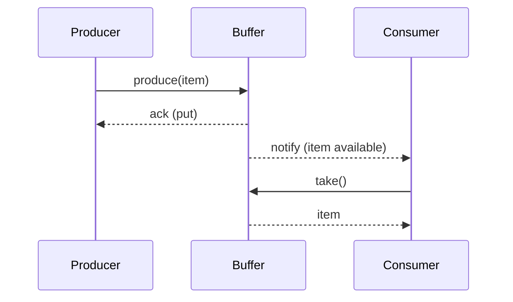

# Producer-Consumer Problem — Interview Q&A

This Q&A guide explains the producer-consumer concurrency problem, common solutions, trade-offs, and interview-style questions — complete with diagrams and runnable examples.

---

**Q1: What is the Producer-Consumer problem?**
- Definition: A concurrency problem where one or more producer threads create data items and place them into a shared buffer, and one or more consumer threads remove and process those items.
- Key concerns: synchronization, ordering, mutual exclusion, bounded buffer capacity, liveness (no deadlocks), and performance.

**Q2: What are typical correctness requirements?**
- Mutual Exclusion: Only one thread may modify buffer metadata (e.g., head, tail, count) at a time.
- No Lost Items: Every item produced should eventually be consumed (unless purposely dropped).
- No Duplicate Consumption: Each item should be consumed at most once.
- Bounded Buffer Safety: Producers block or fail when buffer is full; consumers block or fail when buffer is empty.
- Liveness: No permanent deadlock or starvation.

**Q3: What are the classic synchronization primitives used to solve it?**
- Mutex / Binary Semaphore: Protects critical sections that modify buffer state.
- Counting Semaphores: Track available slots (empty) and available items (full).
- Condition Variables (or wait/notify): Coordinate producers and consumers to wait for buffer state changes.
- Higher-level: Thread-safe queues (BlockingQueue in Java), channels (Go), or concurrent collections.

**Q4: Show a canonical solution using semaphores (bounded buffer).**
- Variables:
  - `mutex` — binary semaphore initialized to 1
  - `empty` — counting semaphore initialized to BUFFER_SIZE (available slots)
  - `full` — counting semaphore initialized to 0 (available items)

- Producer pseudocode:
```
produce(item):
  wait(empty)       // wait for free slot
  wait(mutex)       // enter critical section
  buffer[tail] = item
  tail = (tail + 1) % N
  signal(mutex)     // leave critical section
  signal(full)      // one more full slot
```

- Consumer pseudocode:
```
consume():
  wait(full)        // wait for available item
  wait(mutex)       // enter critical section
  item = buffer[head]
  head = (head + 1) % N
  signal(mutex)     // leave critical section
  signal(empty)     // one more empty slot
  return item
```

**Q5: How does the solution change with condition variables (e.g., Java wait/notify)?**
- Use a single `synchronized` block or `ReentrantLock` for mutual exclusion.
- Producers `await()` when buffer is full; consumers `await()` when buffer is empty.
- After modifying buffer, thread calls `signal()` / `notify()` to wake waiting threads.
- `ReentrantLock` + two `Condition`s (`notEmpty`, `notFull`) is common.

**Q6: Give a minimal Java example using `BlockingQueue`.**
```java
BlockingQueue<String> q = new ArrayBlockingQueue<>(10);
// Producer
new Thread(() -> {
  while (true) {
    String item = produceItem();
    q.put(item); // blocks if full
  }
}).start();

// Consumer
new Thread(() -> {
  while (true) {
    String item = q.take(); // blocks if empty
    consumeItem(item);
  }
}).start();
```
- Using `BlockingQueue` removes the need to manually handle semaphores/locks.

**Q7: What are trade-offs between busy-waiting and blocking approaches?**
- Busy-waiting (spinlock): Low-latency when wait times are extremely short and CPU is abundant (e.g., multi-core), but wastes CPU cycles and increases power.
- Blocking (park/sleep): More CPU efficient, easier to reason about, and preferred for I/O or longer waits. Potentially higher latency due to scheduler wake-ups.

**Q8: How does the problem extend in distributed systems or multiple processes?**
- Shared memory solutions no longer work across machines.
- Use IPC primitives: message queues (RabbitMQ, Kafka), distributed queues (Redis lists), or persistent logs.
- Ensure at-least-once vs exactly-once semantics depending on requirements; handle duplicates via idempotency.

**Q9: What are common interview variants and gotchas?**
- Multiple producers and multiple consumers (M:N) with bounded buffer.
- Priority producers/consumers where certain items must be processed first.
- Graceful shutdown: how to signal consumers to exit when no more work will arrive (poison-pill pattern).
- Avoiding deadlocks when producers and consumers can call back into each other.

**Q10: How to implement graceful shutdown (poison pill)?**
- Enqueue a special sentinel value (poison pill) that tells consumers to stop.
- If multiple consumers exist, enqueue as many poison pills as there are consumers.
- Example in Java: `q.put(POISON_PILL)` repeated for each consumer.

**Q11: What metrics and tests would you run to validate your implementation?**
- Correctness tests: items produced == items consumed, no duplicates.
- Stress test: high throughput with varying producer/consumer ratios.
- Latency tests: measure end-to-end time per item.
- Resource usage: CPU, memory, thread counts.
- Failure/Recovery: kill a consumer/producer mid-run and ensure system recovers.

**Q12: When would you prefer a lock-free queue over `BlockingQueue`?**
- Low-latency systems where GC pauses matter and you require minimal locking overhead.
- High-frequency trading, real-time systems where milliseconds matter.
- Lock-free queues are more complex and require careful memory ordering reasoning.

---

## Diagrams

### Sequence diagram (producer -> buffer -> consumer)



### Flowchart: semaphore-based bounded buffer

```mermaid
flowchart LR
  subgraph Producer
    P1(Produce item) -->|wait(empty)| E[Empty semaphore]
    E --> |wait(mutex)| M[Mutex]
    M --> Put[Put item into buffer]
    Put --> |signal(mutex)| M2[Release mutex]
    M2 --> |signal(full)| F[Full semaphore]
  end

  subgraph Consumer
    C1(Consume request) -->|wait(full)| F2[Full semaphore]
    F2 --> |wait(mutex)| M3[Mutex]
    M3 --> Get[Get item from buffer]
    Get --> |signal(mutex)| M4[Release mutex]
    M4 --> |signal(empty)| E2[Empty semaphore]
  end
```

---

## Quick interview checklist (one-liners you can say in an interview)
- "I would use a `BlockingQueue` for a simple, correct solution." 
- "For bounded buffers, use `empty` and `full` counting semaphores plus a `mutex`."
- "To shutdown, send a poison pill per consumer or use a shared cancellation token."
- "In distributed environments, switch to message brokers or distributed queues and make operations idempotent."

---

If you'd like, I can:
- Add a runnable Java project demonstrating the semaphore solution and `BlockingQueue` example.
- Provide equivalent Go and Python examples.
- Commit this file to your `InterviewQuestions` repo.

File saved to: Database/Producer-Consumer-Interview-Guide.md
